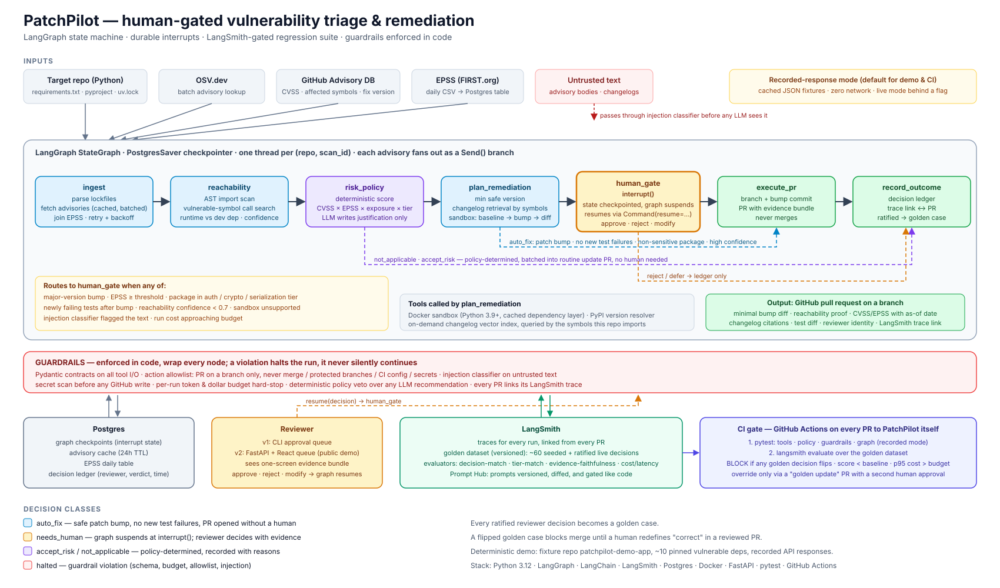

# PatchPilot

Human-gated dependency-vulnerability triage and remediation. A LangGraph state machine scans a
Python repository, works out which advisories are actually reachable, scores them with a
deterministic policy, plans and sandbox-tests the minimal fix, and pauses at a durable
`interrupt()` for a human whenever the policy says so. Every ratified human decision becomes a golden
test case; a LangSmith-driven regression suite blocks any change that flips one.



Full design: [docs/DESIGN.md](docs/DESIGN.md) · decisions: [docs/adr](docs/adr)

## Status — week 1

| step | what | state |
|---|---|---|
| 1 | state schema, lockfile parser, AST reachability, CVSS calculator, recorded-response store | done |
| 2 | OSV + EPSS clients with recorded/live modes, curated symbol overlay | done |
| 3 | graph: `ingest → Send(advisory subgraph) × N → collect`, CLI `patchpilot scan` | done |
| 4 | `risk_policy` (deterministic rules, YAML thresholds/tiers) + `justify` (OpenAI, citation-checked, template fallback, budget meter) | done |
| 5 | `human_gate` with `interrupt()`, Postgres/SQLite checkpointer + ledger, CLI approval queue | done |
| 6 | `plan_remediation`: resolver, changelog retrieval, Docker sandbox baseline diff | done |
| 7 | `execute_pr`, allowlist, secret scan, injection + budget guardrails | done |
| 8 | golden set (38 cases), evaluators, CI gate on decision flips | done |
| 9 | demo app published to its own repo, fixtures frozen against its tag | done |
| 10 | worker entrypoint, approval API, static queue page, hosting, video | in progress |

## Try it

```bash
pip install -e ".[dev]"
patchpilot scan fixtures/patchpilot-demo-app        # recorded mode: zero network
patchpilot queue list                               # the 3 advisories the policy gated
patchpilot queue show GHSA-75c5-xw7c-p5pm           # the evidence bundle, on one screen
patchpilot queue approve GHSA-75c5-xw7c-p5pm --note "reachable in app/auth.py"
pytest                                              # 125 tests, all offline, LLM off
```

The scan pauses at a durable `interrupt()` for every advisory the deterministic policy gated, and
each advisory is its own branch, so approving one never touches the others — the process can exit
between the scan and the approval. Checkpoints and the decision ledger go to Postgres when
`DATABASE_URL` is set, and to a local SQLite file (`.patchpilot/checkpoints.sqlite`) otherwise.

Set `OPENAI_API_KEY` to have `gpt-4o-mini` write the justifications (a few cents per scan);
without it the graph uses a deterministic template and costs nothing. Decisions are identical
either way, by design (ADR-0002). `LANGSMITH_TRACING=true` + `LANGSMITH_API_KEY` traces every
node and model call.

Live mode (`PATCHPILOT_MODE=live`) calls OSV.dev and FIRST EPSS; add `PATCHPILOT_RECORD=1` (or run
`patchpilot record <repo>`) to refresh the fixtures under `src/patchpilot/recorded/fixtures`.

## Two repositories

`patchpilot` is the agent. The scan target is a **separate** repository, and that separation is
load-bearing: `execute_pr` opens pull requests against the target, so PatchPilot must never hold
write access to its own policy, golden expectations or CI workflows. `tools/checkout.py` reads
`.git` only at the path being scanned and never searches upwards, precisely so a target that lives
inside another repository cannot inherit its remote.

`fixtures/patchpilot-demo-app` is the deterministic demo target: a small FastAPI service with ten
pinned dependencies carrying real historical advisories, chosen so every decision class appears.
It is published at the `repo_url` and `tag` recorded in
`src/patchpilot/recorded/fixtures/demo_app.json`, and the vendored copy stays so the suite runs
offline (rule 2). The two cannot drift: every recorded sandbox result is a claim about that exact
tree, so `tests/unit/test_demo_app_frozen.py` recomputes a digest and fails if the app changes
without the fixtures being re-recorded. Rebuild and re-pin with
`python scripts/publish_demo_app.py --build --freeze`.
